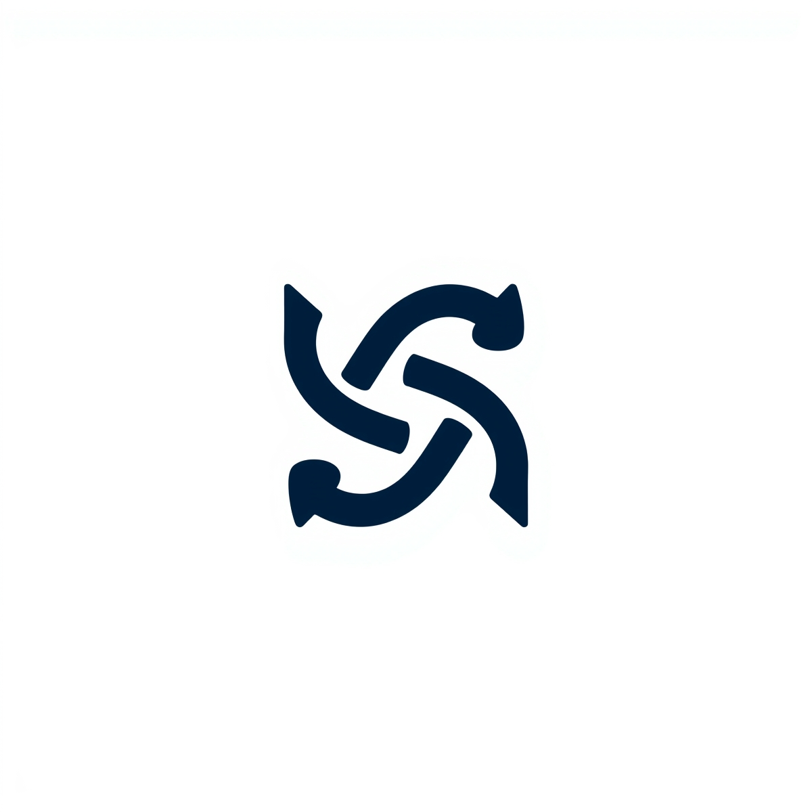

<a id="readme-top"></a>

<br />
<div align="center">
  <a href="https://github.com/HustavoJhon/zolyr">
    
  </a>

  <h2 align="center">ZOLYR — Sistema de Atención Bancaria</h2>

  <p align="center">
    Proyecto universitario desarrollado en C++ que simula el flujo de atención de clientes en una entidad bancaria, aplicando estructuras de datos dinámicas.
    <br />
    <a href="https://obsidian.md/download"><strong>📘 Explorar con Obsidian »</strong></a>
    <br /><br />
    <a href="https://github.com/HustavoJhon/zolyr/tree/main/src">Ver Código</a>
    ·
    <a href="https://github.com/HustavoJhon/zolyr/tree/main/build">▶ Ejecutar Programa</a>
    ·
    <a href="https://github.com/HustavoJhon/zolyr/tree/main/tests"> Testing</a>
  </p>

  <div>
    <a href="#"></a>
    <a href="#"></a>
    <a href="https://obsidian.md/"></a>
    <a href="https://www.docker.com/"></a>
  </div>
</div>

---

<details>
  <summary><b>📑 Tabla de Contenidos</b></summary>
  <ol>
    <li><a href="#sobre-el-proyecto">📘 Sobre el Proyecto</a></li>
    <li><a href="#tecnologías-utilizadas">🛠️ Tecnologías Utilizadas</a></li>
    <li><a href="#instalación">⚙️ Instalación</a></li>
    <li><a href="#integrantes">👥 Integrantes</a></li>
    <li><a href="#licencia">📄 Licencia</a></li>
  </ol>
</details>

---

<h2 id="sobre-el-proyecto">📘 Sobre el Proyecto</h2>

zolyr es un sistema educativo que **simula el flujo de atención bancaria** mediante el uso de **estructuras de datos dinámicas en C++**, demostrando cómo se puede optimizar el servicio al cliente a través de algoritmos eficientes.

### 🔍 Características principales
- **Lista enlazada:** Registro maestro de clientes.
- **Cola de prioridad:** Gestión de turnos (VIP, Preferencial, Regular).
- **Pila:** Registro y reversión de transacciones.
- **Menú interactivo:** Navegación limpia con colores y limpieza automática de pantalla.
- **Diseño modular:** Separación de módulos en carpetas `include` y `src`.

<p align="right">(<a href="#readme-top">Volver arriba ↑</a>)</p>

---

<h2 id="tecnologías-utilizadas">🛠️ Tecnologías Utilizadas</h2>

- **C++17**
- **Markdown / Quarto** (para documentación y presentación)
- **Docker** (para despliegue rápido)
- **Obsidian** (para gestión del repositorio como bóveda)
- **Excalidraw / Draw.io** (para diagramas)

<p align="right">(<a href="#readme-top">Volver arriba ↑</a>)</p>

---

<h2 id="instalación">⚙️ Instalación</h2>

#### 🔹 Instalación y configuración

1. Descarga Obsidian desde su web oficial:  
   👉 [https://obsidian.md/download](https://obsidian.md/download)
2. Instálalo en tu sistema operativo (Windows, Linux o macOS).
3. Clona este repositorio:
   ```bash
   git clone https://github.com/HustavoJhon/zolyr.git
   cd zolyr
    ```
4. Abre Obsidian → selecciona <b>"Abrir carpeta como bóveda"</b>.
5. Elige la carpeta del proyecto `zolyr`.

#### Compilar el proyecto manualmente (sin Docker)
- Abre Dev++ para ejecutar
- Ejecuta el siguiente comando dentro de la carpeta raíz del proyecto:

```bash
g++ src/*.cpp -Iinclude -o zolyr
./zolyr
```
Esto compilará todos los módulos y ejecutará el sistema de menú interactivo en consola.

### Compilar y ejecutar con Docker
Si prefieres usar <b>Docker</b> para mayor portabilidad y mantener el entorno limpio:

```docker
docker build -t zolyr .
docker run -it zolyr
```

Esto construirá una imagen de Docker con el compilador de C++ y ejecutará el programa dentro del contenedor.  

<p align="right">(<a href="#readme-top">Volver arriba ↑</a>)</p>

---

<h2 id="integrantes">👥 Integrantes</h2>

| Nombre | Rol | GitHub |
|--------|------|--------|
| **Jhon Gustavo Ccarita Velasquez** | Líder de Proyecto, Backend | <a href="https://github.com/HustavoJhon"></a> |
| **Rodrigo Sevillanos Tinco** | Implementación de Cola y Testing | <a href="https://github.com/C3b1taz"></a> |
| **Andre Sebastian Espinosa Zea** | Documentación y Diagramas | <a href="https://github.com/BLUESKY211206"></a> |

<p align="right">(<a href="#readme-top">Volver arriba ↑</a>)</p>

---

<h2 id="licencia">📄 Licencia</h2>

Distribuido bajo la licencia <b>MIT</b>.  
Consulta el archivo <a href="LICENSE">LICENSE</a> para más información.

<p align="center">
  <br>
  <br>
  <sub>© 2025 ZOLYR - Proyecto Universitario de Estructura de Datos</sub>
</p>

<p align="right">(<a href="#readme-top">Volver arriba ↑</a>)</p>
